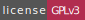

[][homepage]

[][compilers_versions]
[][compilers_versions]

====

# Modern C++ Project

## Introduction

Developed, designed and made by the **Software Developers Team** of CPW Online | [CPW Online website](https://cpwonline.org)

Hello! Thank you for using this software, developed with a lot of effort and affection for the Free Software community.

## About this software

## Features

## Requeriments

## Installation

## How to use this software

## Documentation

## Donations

If you want to help us financially we accept your donations using
Paypal and performing the following steps:

- 1. Access the following URL from your browser: [PayPal - CPW Online](https://paypal.me/cpwonline)
- 2. Let yourself go ;)

## Contact

- **GitHub**: [@cpwonline](https://www.github.com/cpwonline)
- **Web**: [CPW Online](https://www.cpwonline.org)
- **Email**: [CPW Online](mailto:support@cpwonline.org)

## License

This project is under licence [GNU General Public License v3.0](https://www.gnu.org/licenses/gpl-3.0-standalone.html) - see file [LICENSE](LICENSE.md) for more details

[homepage]: https://hub.cpwonline.org/modern-cxx-project/
[compilers_versions]: https://en.cppreference.com/w/cpp/compiler_support
